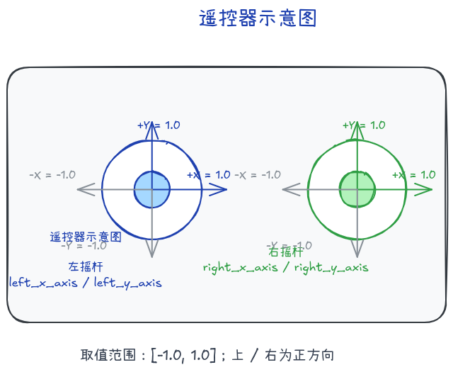
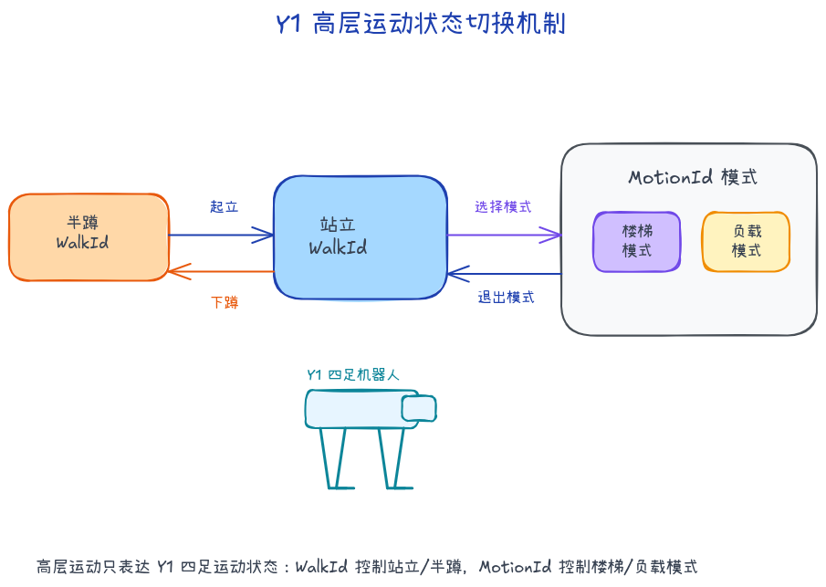
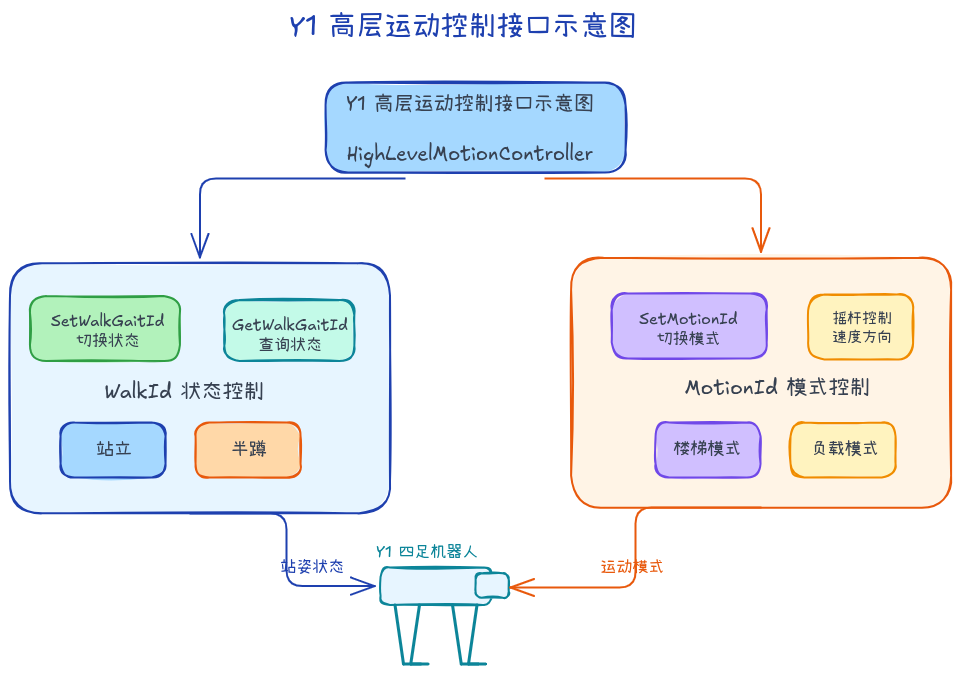
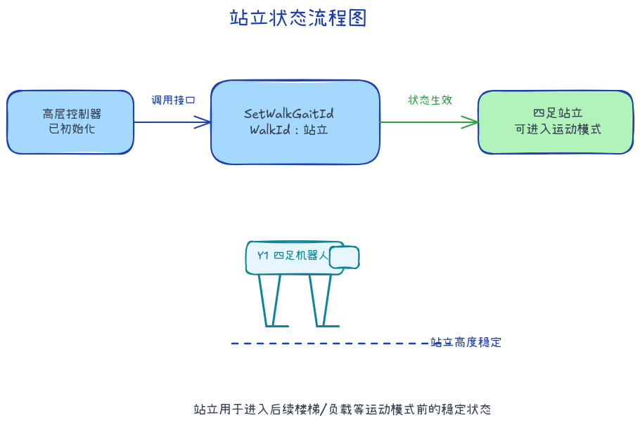
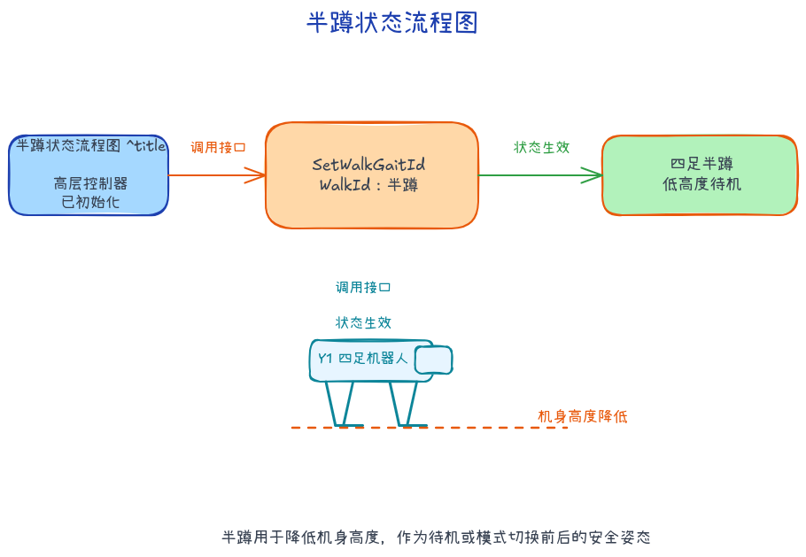
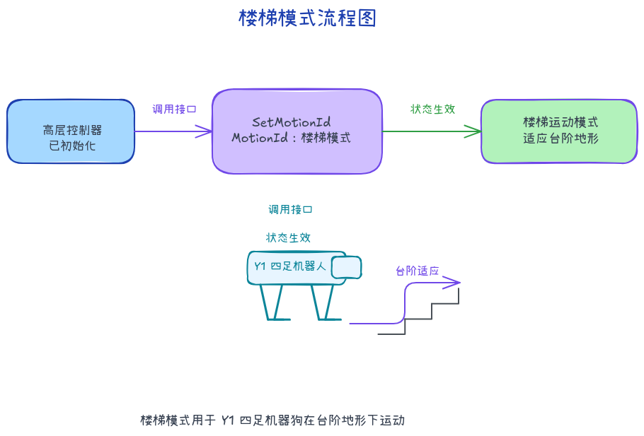
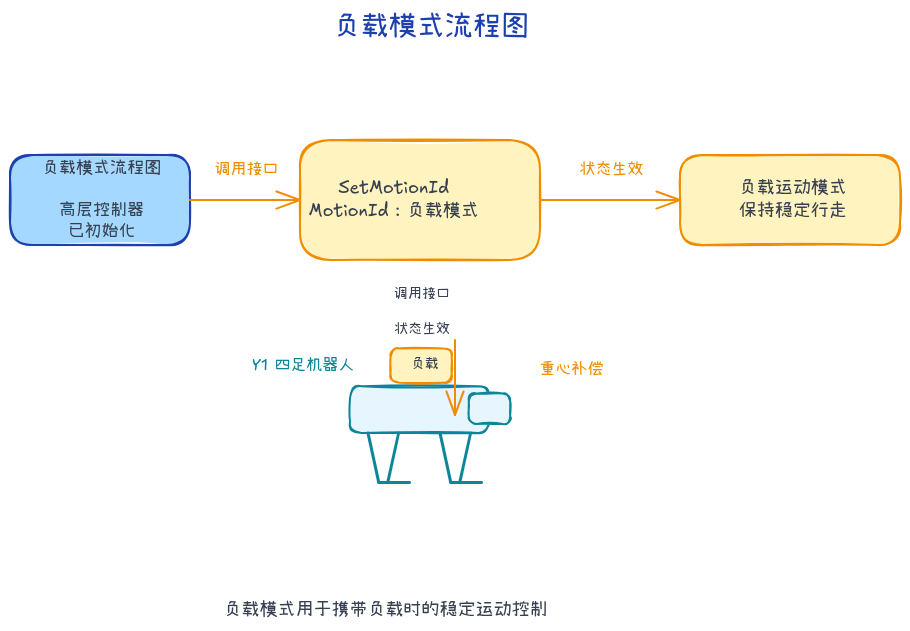

# 高层运动控制服务

> 提供机器人系统高层运动控制服务，通过HighLevelMotionController可以通过RPC通信方式实现对机器人的状态、运动模式、遥控的控制。

## 接口定义
`HighLevelMotionController` 是面向语义控制的高层运动控制器，支持如状态切换、运动模式、遥控等控制操作，封装底层细节以供上层系统调用。

### HighLevelMotionController
<table style="width: 100%; table-layout: fixed; border-collapse: collapse; text-align: left;">
  <thead>
    <tr>
      <th style="width: 40%; text-align: center;"><strong>项目</strong></th>
      <th style="width: 60%; text-align: center;"><strong>内容</strong></th>
    </tr>
  </thead>
  <tbody>
    <tr><td>函数名</td><td>HighLevelMotionController</td></tr>
    <tr><td>函数声明</td><td><code>HighLevelMotionController();</code></td></tr>
    <tr><td>功能概述</td><td>构造函数，初始化高层控制器状态</td></tr>
    <tr><td>备注</td><td>构造内部控制资源</td></tr>
  </tbody>
</table>

### ~HighLevelMotionController
<table style="width: 100%; table-layout: fixed; border-collapse: collapse; text-align: left;">
  <thead>
    <tr>
      <th style="width: 40%; text-align: center;"><strong>项目</strong></th>
      <th style="width: 60%; text-align: center;"><strong>内容</strong></th>
    </tr>
  </thead>
  <tbody>
    <tr><td>函数名</td><td>~HighLevelMotionController</td></tr>
    <tr><td>函数声明</td><td><code>virtual ~HighLevelMotionController();</code></td></tr>
    <tr><td>功能概述</td><td>析构函数，释放控制器资源</td></tr>
    <tr><td>备注</td><td>配合构造函数使用</td></tr>
  </tbody>
</table>

### Initialize
<table style="width: 100%; table-layout: fixed; border-collapse: collapse; text-align: left;">
  <thead>
    <tr>
      <th style="width: 40%; text-align: center;"><strong>项目</strong></th>
      <th style="width: 60%; text-align: center;"><strong>内容</strong></th>
    </tr>
  </thead>
  <tbody>
    <tr><td>函数名</td><td>Initialize</td></tr>
    <tr><td>函数声明</td><td><code>virtual bool Initialize() override;</code></td></tr>
    <tr><td>功能概述</td><td>初始化控制器，准备高层控制功能</td></tr>
    <tr><td>返回值</td><td><code>true</code> 表示成功，<code>false</code> 表示失败</td></tr>
    <tr><td>备注</td><td>首次使用前必须调用</td></tr>
  </tbody>
</table>

### Shutdown
<table style="width: 100%; table-layout: fixed; border-collapse: collapse; text-align: left;">
  <thead>
    <tr>
      <th style="width: 40%; text-align: center;"><strong>项目</strong></th>
      <th style="width: 60%; text-align: center;"><strong>内容</strong></th>
    </tr>
  </thead>
  <tbody>
    <tr><td>函数名</td><td>Shutdown</td></tr>
    <tr><td>函数声明</td><td><code>virtual void Shutdown() override;</code></td></tr>
    <tr><td>功能概述</td><td>关闭控制器并释放资源</td></tr>
    <tr><td>备注</td><td>配合Initialize使用，安全断开连接</td></tr>
  </tbody>
</table>

### SetWalkGaitId
<table style="width: 100%; table-layout: fixed; border-collapse: collapse; text-align: left;">
  <thead>
    <tr>
      <th style="width: 40%; text-align: center;"><strong>项目</strong></th>
      <th style="width: 60%; text-align: center;"><strong>内容</strong></th>
    </tr>
  </thead>
  <tbody>
    <tr><td>函数名</td><td>SetWalkGaitId</td></tr>
    <tr><td>函数声明</td><td><code>Status SetWalkGaitId(const WalkGaitId walk_gait_id, int timeout_ms = 10000);</code></td></tr>
    <tr><td>功能概述</td><td>设置行走步态 ID</td></tr>
    <tr><td>参数说明</td><td><code>walk_gait_id</code>：行走步态枚举 <code>timeout_ms</code>：接口调用的超时时间（单位：毫秒）。</td></tr>
    <tr><td>返回值</td><td><code>Status::OK</code> 表示成功，其他为失败</td></tr>
    <tr><td>备注</td><td>阻塞接口，可切换多种步态模式</td></tr>
  </tbody>
</table>

### GetWalkGaitId
<table style="width: 100%; table-layout: fixed; border-collapse: collapse; text-align: left;">
  <thead>
    <tr>
      <th style="width: 40%; text-align: center;"><strong>项目</strong></th>
      <th style="width: 60%; text-align: center;"><strong>内容</strong></th>
    </tr>
  </thead>
  <tbody>
    <tr><td>函数名</td><td>GetWalkGaitId</td></tr>
    <tr><td>函数声明</td><td><code>Status GetWalkGaitId(WalkGaitId&amp; walk_gait_id, int timeout_ms = 10000);</code></td></tr>
    <tr><td>功能概述</td><td>获取当前行走步态 ID</td></tr>
    <tr><td>参数说明</td><td><code>walk_gait_id</code>：行走步态枚举</td></tr>
    <tr><td>返回值</td><td><code>Status::OK</code> 表示成功，其他为失败</td></tr>
    <tr><td>备注</td><td>阻塞接口，获取当前步态模式</td></tr>
  </tbody>
</table>

### SetMotionId
<table style="width: 100%; table-layout: fixed; border-collapse: collapse; text-align: left;">
  <thead>
    <tr>
      <th style="width: 40%; text-align: center;"><strong>项目</strong></th>
      <th style="width: 60%; text-align: center;"><strong>内容</strong></th>
    </tr>
  </thead>
  <tbody>
    <tr><td>函数名</td><td>SetMotionId</td></tr>
    <tr><td>函数声明</td><td><code>Status SetMotionId(MotionId motion_id, int timeout_ms = 10000);</code></td></tr>
    <tr><td>功能概述</td><td>设置动作 ID</td></tr>
    <tr><td>参数说明</td><td><code>motion_id</code>：动作枚举 <code>timeout_ms</code>：接口调用的超时时间（单位：毫秒）。</td></tr>
    <tr><td>返回值</td><td><code>Status::OK</code> 表示成功，其他为失败</td></tr>
    <tr><td>备注</td><td>阻塞接口，可切换多种动作</td></tr>
  </tbody>
</table>

### GetMotionId
<table style="width: 100%; table-layout: fixed; border-collapse: collapse; text-align: left;">
  <thead>
    <tr>
      <th style="width: 40%; text-align: center;"><strong>项目</strong></th>
      <th style="width: 60%; text-align: center;"><strong>内容</strong></th>
    </tr>
  </thead>
  <tbody>
    <tr><td>函数名</td><td>GetMotionId</td></tr>
    <tr><td>函数声明</td><td><code>Status GetMotionId(MotionId&amp; motion_id, int timeout_ms = 10000);</code></td></tr>
    <tr><td>功能概述</td><td>获取当前动作 ID</td></tr>
    <tr><td>参数说明</td><td><code>motion_id</code>：动作枚举 <code>timeout_ms</code>：接口调用的超时时间（单位：毫秒）。</td></tr>
    <tr><td>返回值</td><td><code>Status::OK</code> 表示成功，其他为失败</td></tr>
    <tr><td>备注</td><td>阻塞接口。如果当前步态不是 <code>MotionId</code> 对应的动作步态，而是行走步态等其他类型，接口返回失败。</td></tr>
  </tbody>
</table>

### SendJoyStickCommand
<table style="width: 100%; table-layout: fixed; border-collapse: collapse; text-align: left;">
  <thead>
    <tr>
      <th style="width: 40%; text-align: center;"><strong>项目</strong></th>
      <th style="width: 60%; text-align: center;"><strong>内容</strong></th>
    </tr>
  </thead>
  <tbody>
    <tr><td>函数名</td><td>SendJoyStickCommand</td></tr>
    <tr><td>函数声明</td><td><code>Status SendJoyStickCommand(const JoystickCommand&amp; joy_command);</code></td></tr>
    <tr><td>功能概述</td><td>发送实时摇杆控制指令</td></tr>
    <tr><td>参数说明</td><td><code>joy_command</code>：包含摇杆坐标的控制数据</td></tr>
    <tr><td>返回值</td><td><code>Status::OK</code> 表示成功，其他为失败</td></tr>
    <tr><td>备注</td><td>非阻塞接口，建议发送频率为 20Hz</td></tr>
  </tbody>
</table>

## 类型定义

### `JoystickCommand` — 高层运动控制摇杆指令结构体

<table style="width: 100%; table-layout: fixed; border-collapse: collapse; text-align: left;">
  <thead>
    <tr>
      <th style="width: 30%; text-align: center;"><strong>字段名</strong></th>
      <th style="width: 20%; text-align: center;"><strong>类型</strong></th>
      <th style="width: 50%; text-align: center;"><strong>描述</strong></th>
    </tr>
  </thead>
  <tbody>
    <tr>
      <td><code>left_x_axis</code></td>
      <td><code>float</code></td>
      <td>左侧摇杆的X轴方向值（-1.0：左，1.0：右）</td>
    </tr>
    <tr>
      <td><code>left_y_axis</code></td>
      <td><code>float</code></td>
      <td>左侧摇杆的Y轴方向值（-1.0：下，1.0：上）</td>
    </tr>
    <tr>
      <td><code>right_x_axis</code></td>
      <td><code>float</code></td>
      <td>右侧摇杆的X轴方向值（旋转 -1.0：左，1.0：右）</td>
    </tr>
    <tr>
      <td><code>right_y_axis</code></td>
      <td><code>float</code></td>
      <td>右侧摇杆的Y轴方向值（暂未定义用途）</td>
    </tr>
  </tbody>
</table>

---

## 枚举类型定义

### `WalkGaitId` — 机器人行走步态枚举

<table style="width: 100%; table-layout: fixed; border-collapse: collapse; text-align: left;">
  <thead>
    <tr>
      <th style="width: 40%; text-align: center;"><strong>枚举值</strong></th>
      <th style="width: 20%; text-align: center;"><strong>数值</strong></th>
      <th style="width: 40%; text-align: center;"><strong>描述</strong></th>
    </tr>
  </thead>
  <tbody>
    <tr>
      <td><code>WALK_GAIT_UNSPECIFIED</code></td>
      <td style="text-align: center;">0</td>
      <td>未指定</td>
    </tr>
    <tr>
      <td><code>WALK_GAIT_TERRAIN</code></td>
      <td style="text-align: center;">9</td>
      <td>全地形行走</td>
    </tr>
    <tr>
      <td><code>WALK_GAIT_LOAD</code></td>
      <td style="text-align: center;">15</td>
      <td>负载行走</td>
    </tr>
  </tbody>
</table>

### `MotionId` — 机器人动作模式枚举

<table style="width: 100%; table-layout: fixed; border-collapse: collapse; text-align: left;">
  <thead>
    <tr>
      <th style="width: 40%; text-align: center;"><strong>枚举值</strong></th>
      <th style="width: 20%; text-align: center;"><strong>数值</strong></th>
      <th style="width: 40%; text-align: center;"><strong>描述</strong></th>
    </tr>
  </thead>
  <tbody>
    <tr>
      <td><code>MOTION_PASSIVE</code></td>
      <td style="text-align: center;">0</td>
      <td>空闲模式</td>
    </tr>
    <tr>
      <td><code>MOTION_RECOVER_STAND</code></td>
      <td style="text-align: center;">1</td>
      <td>站立恢复</td>
    </tr>
    <tr>
      <td><code>MOTION_CROUCH</code></td>
      <td style="text-align: center;">2</td>
      <td>蹲姿</td>
    </tr>
    <tr>
      <td><code>MOTION_CHARGING_HALF_CROUCH</code></td>
      <td style="text-align: center;">7</td>
      <td>充电半蹲</td>
    </tr>
  </tbody>
</table>

---

---

## 遥控器示意图

1. 左右摇杆x轴和y轴的取值范围为[-1.0, 1.0];
2. 左右摇杆x轴和y轴的方向上/右为正，如示意图所示；

## 高层运动控制机器人状态介绍

机器人的运动包含站立、半蹲、楼梯模式、负载模式，机器人在运行过程中，通过状态机在不同状态之间进行切换，以实现不同的控制任务。各个状态的解释说明如下：

- **站立**：站立是机器人进入运动模式前的稳定状态。
- **半蹲**：半蹲用于降低机身高度，作为待机或模式切换前后的安全姿态。
- **楼梯模式**：楼梯模式用于台阶地形下的运动控制。
- **负载模式**：负载模式用于携带负载时的稳定运动控制。

机器人状态切换机制；

## 高层运动控制接口

机器人的高层运动控制服务可分为 WalkId 状态控制、MotionId 模式控制和遥控控制。
- WalkId 状态控制中，可调用相应的接口切换站立、半蹲等基础状态。
- MotionId 模式控制中，可调用相应的接口切换楼梯模式、负载模式等运动模式。
- 遥控控制中，可发送摇杆指令控制机器人的速度和方向。

### 运动状态切换

<table style="width: 100%; table-layout: fixed; border-collapse: collapse; text-align: center;">
  <thead>
    <tr>
      <th style="width: 20%; text-align: center;"><strong>控制目标</strong></th>
      <th style="width: 40%; text-align: center;"><strong>状态切换流程</strong></th>
      <th style="width: 40%; text-align: center;"><strong>示意图</strong></th>
    </tr>
  </thead>
  <tbody>
    <tr>
      <td style="text-align: center;">站立</td>
      <td></td>
      <td></td>
    </tr>
    <tr>
      <td style="text-align: center;">半蹲</td>
      <td></td>
      <td></td>
    </tr>
    <tr>
      <td style="text-align: center;">楼梯模式</td>
      <td></td>
      <td></td>
    </tr>
    <tr>
      <td style="text-align: center;">负载模式</td>
      <td></td>
      <td></td>
    </tr>
  </tbody>
</table>

---
